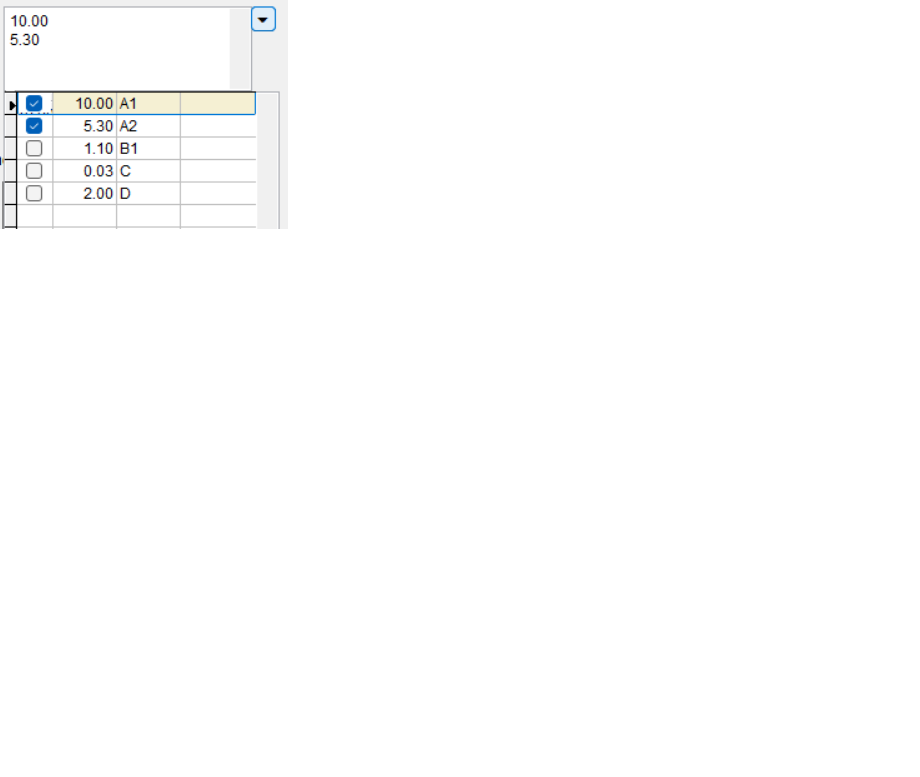

# VFP Component Classes - Multi Select Controls

## Multi Select Control (multiSel)

This repository release includes a newer "multiSel" custom control as an alternative to the combo-based cboMultiSel. This new control allows for mulit-line display of selections (in an Edit Box). Another goal was try and eliminate the form-based picklist of cboMultiSel which was can cause some parent form relase lock-ups at times. You might find this new control to be more responsive as well. The caveat is that the picklist display is limited to the container area on which this control is placed. This should not be a problem in most cases.

Like cboMultiSel, this control allows storing multiple selections in one field (e.g., a database or object property) as a separated list.

Configurable properties (note that these may be different from cboMultiSel):

	.ControlSource		&& Standard VFP binding; e.g., object property or table field.
	.ValueColumn			&& The picklist data column name to use for bound values. Default is the 1st data column.
	.DisplayColumn		&& The picklist data column name to use for display values. Default is the 1st data column.
	.ColumnCount			&& Number of columns to display on the picklist.
	.ColumnWidths		&& Widths of the picklist columns as a comma-separated string: e.g., "30,150,80"
	.ColumnTitles		&& Optional column titles: e.g., "Code,Name,Date". Requires ShowListHeaders=.T.
	.DisplayCount		&& Number of picklist items to display (might be less if container area restricts).
	.DisplaySeparator	&& Text/character to separate display values: e.g, "," or CHR(10)
	.ValueSeparator		&& Text/character to separate selected values:
	.ValueDelimiter		&& Optional delimiter for selected values; for instance, enclosing each value in quotes.
	.ValueDelimiterRt	&& Right side value delimiter (if different from left)
	.SearchColumns		&& Names of data columns to use for searching (while list is activated).
	.ShowListHeaders		&& Flag whether to show picklist column headers. Default is false (.F.).
	.RowSourceType		&& Standard VFP RowSourceType (as with a combobox), but limited to types 2, 3, or 6.
	.RowSource			&& The data source to use for the picklist, commensurate with RowSourceType.

As with cboMultiSel, set the RowSource property last in code-based configurations. The control is built when this values is set.

See the accompanying test form, **MultiSelTest.sc?**, for complete examples.

## Multi Select ComboBox Control (cboMultiSel)

A combo box-style control for selecting multiple values from a list and storing as a single, character-separated string. This was inspired by, and is a total rebuild of, a similar control floating around: "multiSelCombo".

The class is designed to be all-in-one (clutter-free) where there are no secondary/ancillary files required beyond the FoxPro and Windows APIs.

Usage, briefly:

	* Drop this control on a form and configure its rowSource property (must be 2-alias, 3-SQL statement, or 6-fields)
	* Configure the instance, say, from an init event:

		.RowSourceType=6					&& Fields
		.ControlSource="Thisform.mySels"	&& what we'll bind the value to
		.ColumnWidths = "15, 200"	
		.srcValCol = "CD"					&& data source column/field to use for the values
		.srcDispCol = "NME"					&& data source column to use for the display values
		.valDelim = "'"						&& optional delimiter to surround selected values with
		.srcColTitls = "Code, Name" 		&& titles for the columns (if headers are shown)
		.RowSource = "CSRC.CD, NME"			&& the data columns for the picklist (set this  last)

See the accompanying test form, **cboMultiSelTest.sc?**, for complete examples.

G. Willcockson

## Releases

<<<<<<< HEAD
### 2023-08-17

Introduced new MultiSel control

=======
>>>>>>> 6ac0e832cbe28e0c71dee4c9148b4402b02e0592
### 2023-04-12

Enhanced to includes the following:

- Ability to paste a separated value string into the combo which will select values in the underlying list.

> - Values in the separated value string that don't have a match in the defining list will be removed

- Typing characters while focused on the control can fire the dropdown and search for the typed character(s).

> - Requires specifying up to two data column indexes that will be used for value compares (via LOCATE)
> - Only valid for text based column values - characters 0-9, a-Z
> - Match is case-insensitive
> - Match is from the beginning of the value: substring  matches not (yet) supported
> - Matching starts over at beginning of list after no more matches

### 2022-07-11

* Fixed not being able to close the form using Thisform.Release after opening the combobox.
* Add text equivalents of binary files to the repository.

### 2020-07-24

* Updated documentation

### March 2020

* Initial release
